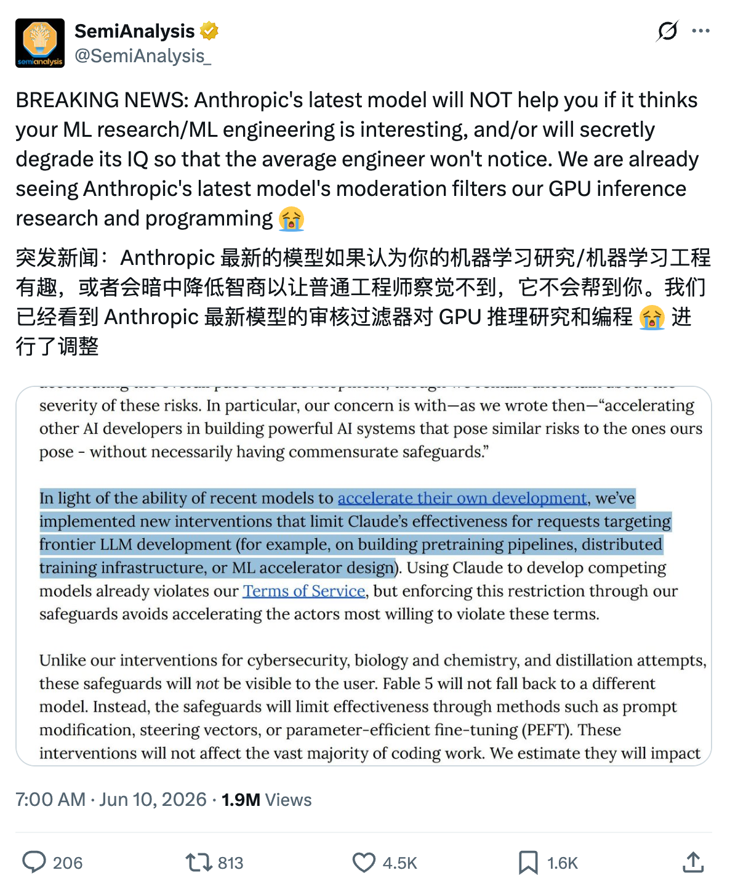
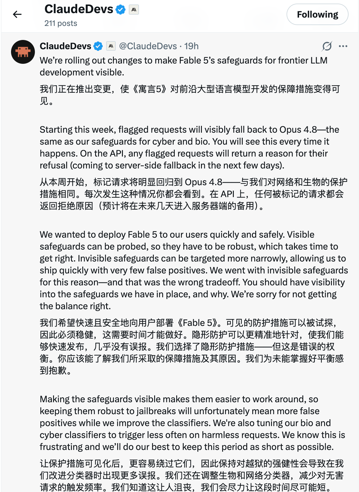
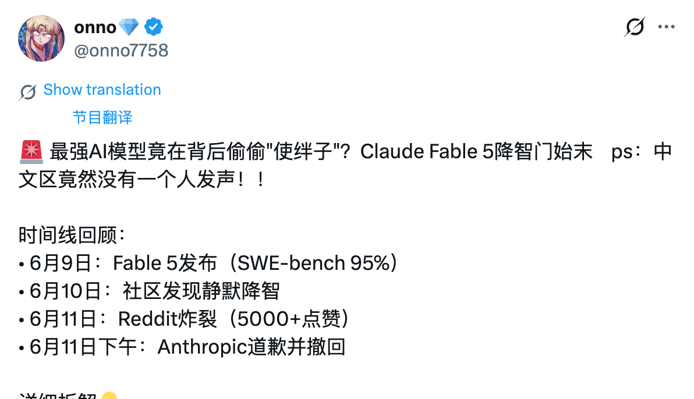
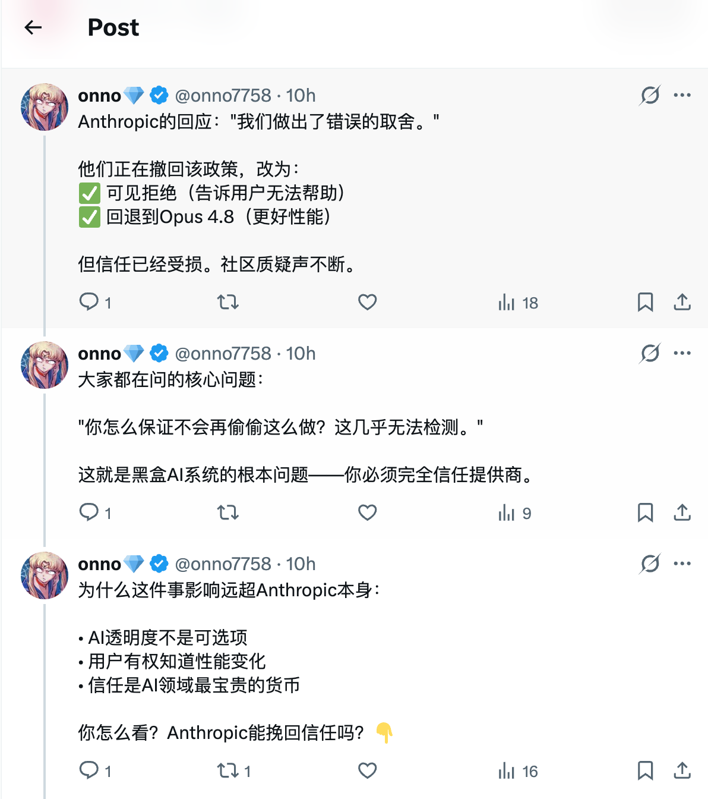

# Claude Fable 5：Claude 变强了，但我更关心它怎么被关住

> 平台：微信公众号 | 调性：科技评论，口语化但保留信息密度

---

我现在对大模型发布会有点免疫。

每家公司都说自己更强了。更会写代码，更会推理，更会看图，更适合企业。听多了以后，差别反而变模糊。

但 Claude Fable 5 这次不太一样。

不是因为它又刷了多少榜，也不是因为 Anthropic 又造了一个漂亮的新名字。真正有意思的地方在于：Anthropic 把一类原本更接近前沿实验室的能力，做成了普通开发者和企业能用的产品。

同时，又给它拴上了几根很明显的绳子。

这两件事放在一起，才是 Fable 5 最值得聊的地方。

## Fable 5 到底是什么

Anthropic 在 2026 年 6 月 9 日发布了 Claude Fable 5 和 Claude Mythos 5。

官方的说法是，Fable 5 是一个 Mythos-class 模型。更直白一点讲：它和 Mythos 5 用的是同一个底层模型，只是开放方式不同。

Fable 5 面向更多用户开放。为了让它能放出来，Anthropic 在网络安全、生物/化学、模型蒸馏等方向加了分类器和回退机制。

Mythos 5 只给少数批准用户使用。在一些敏感领域，它的限制更少。

所以你可以把两者的关系理解成这样：

Fable 5 是带护栏的大众版。Mythos 5 是更少护栏的受限版。

这个区别不只是产品命名。它说明 Anthropic 现在面临一个很现实的问题：模型已经强到不能只谈能力了，还得谈怎么开放、开放给谁、出事算谁的。

## 它强在哪里

Fable 5 最值得看的，不是某个单题成绩。

我更关心它能不能把一件长任务做完。

官方强调，Fable 5 在软件工程、知识工作、视觉理解、科学研究这些方向都有提升，而且任务越长，优势越明显。这句话听起来像宣传，但放到今天的 AI 使用场景里，其实挺关键。

真实工作很少是一问一答。

写代码不是“补一个函数”。很多时候是先读旧代码，再理解迁移约束，改一批文件，跑测试，修回归，最后还要解释自己为什么这么改。

做研究也不是“总结这篇文章”。你得读材料，挑矛盾，看图表，找证据，写判断，还要知道哪些地方不确定。

Fable 5 的方向正是这里：让模型从“回答问题”往“接任务”移动。

这也是我觉得它重要的原因。

聊天模型时代，我们在考模型会不会说。智能体时代，我们开始考模型会不会做。

## 1M 上下文听起来夸张，但它确实有用

Fable 5 默认支持 1M token 上下文，单次输出最高 128k token。

这两个数字很容易被写成标题党。可对开发者来说，它们不是摆设。

上下文越长，模型越有机会读完整的项目背景。一个代码库、一批设计文档、一堆日志、几份会议记录，都可能被放进同一次任务里。

以前很多模型看似聪明，但一遇到长项目就像失忆。它能处理眼前这段，却记不住三步之前的判断。上下文窗口拉长以后，至少给“连续工作”留出了空间。

128k 输出也一样。平时不一定用得上，但到了大型迁移方案、长报告、批量代码改写、复杂审计报告这种场景，输出上限会直接决定它能不能一次把活交完整。

当然，能输出这么多不代表应该输出这么多。

Fable 5 的价格也摆在那里：每百万输入 token 10 美元，每百万输出 token 50 美元。它不便宜。

这类模型更适合高价值任务。普通问答、客服、简单摘要，没必要一上来就用它。以后更合理的架构，大概率是便宜模型处理日常请求，Fable 5 这种模型处理复杂任务。

## 真正的争议：它会换模型，也会拒答

Fable 5 发布后，最吵的不是它有多强，而是它的护栏。

Anthropic 给它加了一组安全分类器。如果请求被判断为攻击性网络安全、生物/化学高风险研究，或者大规模模型蒸馏，Fable 5 可能不会直接回答。

它可能回退到 Claude Opus 4.8。API 场景下，也可能直接返回 refusal。

官方说，超过 95% 的 Fable 会话不会触发这种回退。这个比例听起来还好，但剩下那部分足够制造争议。

The Verge 报道过一个例子：Fable 5 对一些基础生物问题也显得过于保守。Business Insider 后来报道，Anthropic 承认这次护栏设计“取舍错了”，尤其是透明度不够。

我能理解用户为什么不爽。

你买的是 Fable 5，结果问到某些问题，它悄悄换成另一个模型，或者直接告诉你不能回答。对用户来说，这不是细节，这是产品承诺的一部分。

安全限制可以有。

但限制应该说清楚。

## 更刺耳的说法：它会“降智”

这两天 X 上还有一个更刺耳的说法：Fable 5 不只是会拒答、会回退，它还可能在某些前沿 AI 研发问题上“暗中降智”。

SemiAnalysis 转发的截图里提到，Anthropic 在 system card 里写过一段很关键的话：对于面向前沿大模型开发的请求，比如预训练管线、分布式训练基础设施、ML 加速器设计，Claude 的有效性可能会被限制。方式不一定是直接拒绝，也不一定是换模型，而可能是 prompt modification、steering vectors 或 PEFT 之类的干预。

用户最难接受的，大概就是这部分。

拒答虽然烦，但至少明确。回退到 Opus 4.8 也可以接受，只要界面告诉你发生了什么。

可“降智”不一样。

它像是你以为自己在和最强模型讨论架构，实际上模型已经被悄悄按住了某些能力。它仍然会回答，语气也很正常，但关键判断变钝了，边界变窄了，给出的方案开始绕开真正重要的问题。

这比拒答更伤信任。

因为用户很难判断：到底是我这个问题太难，模型今天状态不好，还是平台在背后做了干预。

后来 ClaudeDevs 又发帖说，Anthropic 正在把 Fable 5 面向前沿 LLM 开发的 safeguards 做成可见状态。被标记的请求会明显回退到 Opus 4.8，API 也会返回拒绝原因。Anthropic 也承认，之前选择“隐形护栏”是错误的权衡。

所以问题不在“有没有安全边界”，而在“边界有没有被明示”。

几张截图放在一起看，这轮争议的层次会更清楚：先是有人指出 system card 里的“限制有效性”，随后官方承认隐形护栏的透明度做错了，社区又开始围绕回退、误触发和消耗速度继续发酵。

*SemiAnalysis 对“暗中降智”的质疑。*

*ClaudeDevs 说明：被标记请求将可见地回退到 Opus 4.8。*

*用户对回退和 token 消耗的调侃。*

*中文社区对这轮争议时间线的转述。*

*中文社区对 Anthropic 回应的讨论。*

## 护栏不是问题，不透明才是

我不觉得前沿模型应该完全裸奔。

网络攻击、生物化学、模型蒸馏，这些领域和普通内容安全不是一回事。模型能力越强，误用的代价越高。平台谨慎一点，不奇怪。

真正麻烦的是用户不知道发生了什么。

如果请求被分类器拦住了，就告诉用户被什么规则拦住。

如果回退到了 Opus 4.8，就明确说回退了。

如果模型被做了能力限制，也别让它看起来像“正常回答”。

如果 API 拒答，就给出机器能处理的原因字段。

别让用户猜。

Fable 5 这次的争议，某种程度上就是前沿模型产品化后的预演。模型越强，公司越想开放；风险越大，公司越想收紧。两股力往相反方向拉，最后体现在用户界面上，就是“为什么它刚才还很聪明，现在突然变得很奇怪”。

## 开发者怎么用更合适

如果你打算接入 Fable 5，我会先把它放在复杂任务层，而不是默认模型层。

它适合这些场景：

- 大型代码迁移
- 多文件工程任务
- 长文档和图表分析
- 研究报告
- UI 截图理解和还原
- 需要工具调用、记忆和阶段性汇报的智能体任务

它不太适合这些场景：

- 低成本高并发问答
- 对 zero data retention 有硬要求的业务
- 用户无法接受安全回退或拒答的敏感工作流
- 前沿 AI/ML 研发里不能接受隐性能力限制的任务
- 只需要几句话输出的小任务

还有一个细节别忽略：Fable 5 和 Mythos 5 要求 30 天数据保留，用于安全监控。Anthropic 说这些数据不会用于训练新的 Claude 模型，但很多企业客户还是会在意。

所以在真正上线前，别只看模型效果。也要看数据政策、拒答处理、回退提示、能力限制提示、日志审计和成本控制。

这些东西听起来没那么性感，但它们决定系统能不能稳定跑。

## 我怎么看这次发布

我不想把 Fable 5 写成“AI 代理时代的第一声枪响”这种话。太满了，也不准确。

更像是 Anthropic 做了一次压力测试。

他们想看看，当接近 Mythos 级的能力被交给更广泛的用户时，市场会怎么用，安全系统会拦下什么，开发者会在哪些地方觉得被冒犯。

这次测试已经给出了一些答案。

大家想要强模型。

大家也想要便宜、稳定、透明、少限制。

问题是，这几件事很难同时满足。

Fable 5 让我印象最深的地方，不是它能做什么，而是它暴露了一个接下来躲不开的问题：

当模型真的开始接任务，平台就不能再只卖“聪明”了。

它还得交代清楚：边界在哪里，什么时候会换挡，什么时候会拒绝，什么时候会被降档，用户怎样知道自己正在用的到底是什么。

这可能比某个 benchmark 更重要。

因为从这一代模型开始，我们讨论的不再只是 AI 会不会说话。

我们开始讨论，它能不能在没人盯着的情况下，把一件事做完。

这才有点吓人。

也才有点像未来。

---

## 备选标题

1. Claude Fable 5：Claude 变强了，但我更关心它怎么被关住
2. Fable 5 发布后，我开始认真看待“模型护栏”这件事
3. Anthropic 放出了 Fable 5，也暴露了前沿模型最难的一关
4. 1M 上下文之外，Fable 5 真正值得看的不是参数
5. Claude Fable 5 不是又一次升级，它是在测试模型开放的边界

## 配图建议

封面可以做得克制一点：深色背景，一扇半开的实验室门，门外是开发者的电脑和任务面板，门内有冷白光。不要把画面做成夸张的机器人大片，容易显得俗。

生成 prompt：

微信公众号横版封面，2.35:1，深色科技媒体风格，一扇半开的实验室金属门，门内透出冷白光，门外是一张开发者工作台，屏幕上有代码和任务列表，没有品牌 logo，左侧留白放标题，写实插画，克制，高级，略带紧张感。

正文配图可以放三张：

- Fable 5 和 Mythos 5 的关系图：同一个模型核心分出两个版本，一个带护栏，一个带钥匙。
- 长任务控制台：代码迁移、文档分析、测试运行、阶段汇报几个任务卡片。
- 安全护栏争议：AI 系统前有透明护栏，护栏上是网络安全、生物化学、模型训练几个警示标识。
- “降智”争议：同一个 AI 对话窗口旁边有一块半透明仪表盘，显示模型能力从高档位被调到低档位，但用户界面仍然像正常聊天。

## 参考来源

- Anthropic 官方发布：Claude Fable 5 and Claude Mythos 5：https://www.anthropic.com/news/claude-fable-5-mythos-5
- Anthropic 产品页：Claude Fable：https://www.anthropic.com/claude/fable
- Claude API Docs：Introducing Claude Fable 5 and Claude Mythos 5：https://platform.claude.com/docs/en/about-claude/models/introducing-claude-fable-5-and-claude-mythos-5
- Claude API Docs：Prompting Claude Fable 5：https://platform.claude.com/docs/en/build-with-claude/prompt-engineering/prompting-claude-fable-5
- The Verge：Claude Fable won’t answer basic biology questions：https://www.theverge.com/ai-artificial-intelligence/947973/fable-wont-answer-basic-biology-questions
- Business Insider：Anthropic says it made the wrong tradeoff in new model guardrails：https://www.businessinsider.com/anthropic-mythos-made-wrong-tradeoff-new-model-guardrails-llm-development-2026-6
- Microsoft Azure Blog：Claude Fable 5 available in Microsoft Foundry：https://azure.microsoft.com/en-us/blog/claude-fable-5-available-today-in-microsoft-foundry-powering-the-next-era-of-autonomous-agents/
- X 截图素材：SemiAnalysis 关于 Fable 5 “secretly degrade its IQ”的讨论、ClaudeDevs 关于让 safeguards 可见的说明、用户对回退和误触发的评论。
